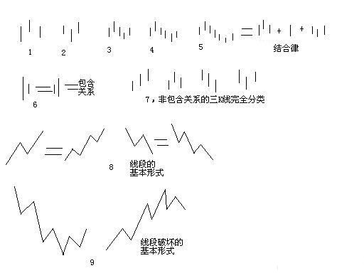

# 62.分型、笔与线段

> **url**: http://blog.sina.com.cn/s/blog_486e105c01000bf2.html
>
> **time**: *2007-06-30 09:49:51*

## 原文

在宾馆里闲着等着10点开始的腐败，半个小时，找个面首来面首有点时间紧张，还不如给各位写个主贴，来个课程，耗费一下各位周末腐败的时间。

瞧了一下，有位叫石猴的网友写了帖子来解释什么是线段，他的理解还行，但不够严密。其实，本ID的线段是可以最精确定义的，本ID的理论，本质上是一套几何理论，其有效性就如同几何一般，本ID理论当然有失败不严谨的时候，但这前提是几何的基础失败不严谨，不明白这一点，就不明白本ID的理论。这里，就把本来是后面的课程提前说说。

下面的定义与图，都适合任何周期的K线图。先看图中的第1、2，图中的小线段代表的是K线，这里不分阳线阴线，只看K线高低点。

像图1这种，第二K线高点是相邻三K线高点中最高的，而低点也是相邻三K线低点中最高的，本ID给一个定义叫顶分型；图2这种叫底分型，第二K线低点是相邻三K线低点中最低的，而高点也是相邻三K线高点中最低的。看不明白定义的，看图就明白了，这么直观都不明白，那去和孔男人为伍吧。

顶分型的最高点叫该分型的顶，底分型的最低点叫该分型的底，由于顶分型的底和底分型的顶是没有意义的，所以顶分型的顶和底分型的底就可以简称为顶和低。也就是说，当我们以后说顶和底时，就分别是说顶分型的顶和底分型的底。

两个相邻的顶和底之间构成一笔，所谓笔，就是顶和底之间的其他波动，都可以忽略不算，但注意，一定是相邻的顶和底，隔了几个就不是了。而所谓的线段，就是至少由三笔组成。但这里有一个细微的地方要分清楚，因为结合律是必须遵守的，像图3这种，顶和底之间必须共用一个K线，这就违反结合律了，所以这不算一笔，而图4，就光是顶和底了，中间没有其他K线，一般来说，也最好不算一笔，而图5，是一笔的最基本的图形，顶和底之间还有一根K线。在实际分析中，都必须要求顶和底之间都至少有一K线当成一笔的最基本要求。

当然，实际图形里，有些复杂的关系会出现，就是相邻两K线可以出现如图6这种包含关系，也就是一K线的高低点全在另一K线的范围里，这种情况下，可以这样处理，在向上时，把两K线的最高点当高点，而两K线低点中的较高者当成低点，这样就把两K线合并成一新的K线；反之，当向下时，把两K线的最低点当低点，而两K线高点中的较低者当成高点，这样就把两K线合并成一新的K线。经过这样的处理，所有K线图都可以处理成没有包含关系的图形。

而图7，就给出了经过以上处理，没有包含关系的图形中，三相邻K线之间可能组合的一个完全分类，其中的二、四，就是分别是顶分型和底分型，一可以叫上升K线，三可以叫下降K线。所以，上升的一笔，由结合律，就一定是底分型+上升K线+顶分型；下降的一笔，就是顶分型+下降K线+底分型。注意，这里的上升、下降K线，不一定都是3根，可以无数根，只要一直保持这定义就可以。当然，简单的，也可以是1、2根，这只要不违反结合律和定义就可以。

至于图8，就是线段的最基本形态，而图9，就是线段破坏，也就是两线段组合的其中一种形态。有人可能要说，这怎么有点像波浪理论，这有什么奇怪的，本ID的理论可以严格地推论出波浪理论的所有结论，而且还可以指出他理论的所有不足，波浪理论和本ID的理论一点可比性都没有。不仅是波浪理论，所有关于股市的理论，只要是关系到图形的，本ID的理论都可以严格推论，因为本ID的理论是关于走势图形最基础的理论，谁都逃不掉。

不能再废话了，下面车来了，腐败开始，大家也腐败去吧。

## 扩展阅读

### 评论答疑

> *2007-08-21 17:02:26*
>
> 缠中说禅：对於有代表性的问题，再多说两句。
>
> 笔破坏与线段破坏，是两个不互相包含的概念。并不是笔破坏就一定线段破坏，也不是线段破坏一定要笔破坏。显然，在线段破坏的第一种 情况下，必然是笔破坏的。在线段破坏的第二种情况下，就不一定了。反之，线段破坏如果不是笔破坏，那么一定是第二种情况的。那么，笔破 坏为什么要单独提出来？因为笔破坏有动力学上意义。 本 ID 的理论，有一部分和物理学有点类似，就是探讨动力学方面的东西，这方面，各位现在接触最多的就是背驰，而笔破坏，和这一样属於动力学方面的内容，这在以后会逐步说到的。 先形态学，再动力学，各位慢慢来。

## 笔者注

### K线

K线图又称蜡烛图（Candlestick Charts）、日本线、阴阳线、棒线等，常用说法是“K线”，起源于日本十八世纪德川幕府时代（1603～1867年）的米市交易，用来计量每天米价的涨跌。

K线由四个价位组成：

+ 开盘价
+ 收盘价
+ 最低价
+ 最高价

其中，开盘价和收盘价又称为**实际价格**组成蜡烛实体部分，最低价和最高价**波动价格**用影线表示波动范围。如果收盘价高于开盘价，则为红色蜡烛，表示上涨，反正则为绿色蜡烛，表示下跌。

### 分型

相邻的三条K线中，如果**中间**一条K线的最高点和最低点均是相邻两条K线高低点的最高点或最低点，则形成分型：该K线的高低两点均最高称为**顶分型**，高低两点均最低称为**底分型**。

顶分型的底和底分型的顶都是无意义的，所以顶分型一般简称为**顶**，底分型一般简称为**底**。

需要注意的是，为何特别说明中间的K线满足条件才能叫分型呢，如图7所示，1图和3图其实是满足条件的，但因为不是中间的K线，因此变成了上升线和下降线。为什么要这样定义呢？我们可以发现，这是在记录“变化”，顶分型是记录上升到下降的变化，底分型是记录下降到上升的变化，否则就变成了单一的上升或单一的下降，而没有变化存在。

不仅如此，我们往后观察就知道，笔的定义也是为了**记录变化**，因为必须是顶底相邻的结构才能构成一笔，而至少三笔构成了一条线段，说明线段也是记录变化的定义。

有变，才有化，亦才有机会。

### 笔

两个相邻的顶和低**之间**构成**一笔**，也就是顶和底之前的其他波动，都可以一笔划过，都可以忽略不记。

注意前提是：**相邻，且满足结合律**。结合律就是相邻的顶和底必须保证期间存在额外至少一条K线，即顶和底不能共用k线，也不能光是顶 +底的形式，简单来说就是必须满足**顶 + 若干条k线 + 底**的形式。

**上升的一笔** = 底分型 + 上升的K线 + 顶分型。

**下降的一笔** = 顶分型 + 下降的K线 + 底分型。

### 线段

至少三条笔构成一条线段。

可以发现，笔是由先上升后下降或先下降再上升的状态，那么连续的笔构成的线段就必然是在上升和下降直接不断波动，如果出现波动相同的相邻一笔，则线段就**被破坏了**。

### 包含关系

再判断分型时，有时会出现相邻的两条K线其中一条完全包含另一条的情况，这时候可以将这种具有包含关系的Kk线合并为一条k线。对于上升的k线来说，关注的是高点，各取两条k线的高低点的较高点，绘制成一条新的K线作为代表，而对于下降的K线，关注的则是低点，各取两条K线高低点的较低点，绘制成一条新的K线。

一般来说，在进行分型标记之前，先移除K线之间的包含关系。
