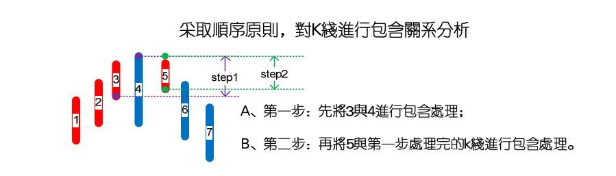

# 65：再说说分型、笔、线段

> **url**: http://blog.sina.com.cn/s/blog_486e105c01000bpo.html
>
> **time**: *2007-07-16 22:14:16*

## 原文

如果真明白了前面的，这课就不必再说了。本ID反复强调，本ID理论的关键是一套几何化的思维，因此，你需要从最基本的定义出发，而在实际操作的辨认中，这一点更重要。所有复杂的情况，其实，从最基本的定义出发，都没有任何的困难可言。

例如，对于分型，里面最大的麻烦，就是所谓的前后K线间的包含关系，其次，有点简单的几何思维，根据定义，任何人都可以马上得出以下的一些推论：

1、用[di,gi]记号第i根K线的最低和最高构成的区间，当向上时，顺次n个包含关系的K线组，等价于[maxdi,maxgi]的区间对应的K线，也就是说，这n个K线，和最低最高的区间为[maxdi,maxgi]的K线是一回事情；向下时，顺次n个包含关系的K线组，等价于[mindi,mingi]的区间对应的K线。

2、结合律是有关本ID这理论中最基础的，在K线的包含关系中，当然也需要遵守，而包含关系，不符合传递律，也就是说，第1、2根K线是包含关系，第2、3根也是包含关系，但并不意味着第1、3根就有包含关系。因此在K线包含关系的分析中，还要遵守顺序原则，就是先用第1、2根K线的包含关系确认新的K线，然后用新的K线去和第三根比，如果有包含关系，继续用包含关系的法则结合成新的K线，如果没有，就按正常K线去处理。

3、有人可能还要问，什么是向上？什么是向下？其实，这根本没什么可说的，任何看过图的都知道什么是向上，什么是向下。当然，本ID的理论是严格的几何理论，对向上向下，也可以严格地进行几何定义，只不过，这样对于不习惯数学符号的人，头又要大一次了。

假设，第n根K线满足第n根与第n+1根的包含关系，而第n根与第n-1根不是包含关系，那么如果gn>=gn-1，那么称第n-1、n、n+1根K线是向上的；如果dn<=dn-1，那么称第n-1、n、n+1根K线是向下的。

有人可能又要问，如果gn<gn-1且dn>dn-1，算什么？那就是一种包含关系，这就违反了前面第n根与第n-1根不是包含关系的假设。同样道理，gn>=gn-1与dn<=dn-1不可能同时成立。

上面包含关系的定义已经十分清楚，就是一些最精确的几何定义，只要按照定义来，没有任何图是不可以精确无误地、按统一的标准去找出所有的分型来。注意，这种定义是唯一的，有统一答案的，就算是本ID，如果弄错了，也就是错，没有任何含糊的地方，是可以在当下或任何时候明确无误地给出唯一答案的，这答案与时间无关，与人无关，是客观的，不可更改的，唯一的要求就是被分析的K线已经走出来。

从这里，本ID理论的当下性也就有了一个很客观的描述。为什么要当下的？因为如果当下那些K线还没走出来，那么具体的分型就找不出来，相应的笔、线段、最低级别中枢、高级别走势类型等就不可能划分出来，这样就无从分析了。而一旦当下的K线走出来，就可以当下按客观标准唯一地找出相应的分型结构，当下的分析和事后的分析，是一样的，分析的结果也是一样的，没有任何的不同。因此，当下性，其实就是本ID的客观性。 

有人可能要问，如果看30分钟图，可能K线一直犬牙交错，找不到分型。这有什么奇怪的，在年线图里，找到分型的机会更小，可能十几年找不到一个也很正常，这还是显微镜倍数的比喻问题。确定显微镜的倍数，就按看到的K线用定义严格来，没有符合定义的，就是没有，就这么简单。如果希望能分析得更精确，那就用小级别的图，例如，不要用30分钟图，用1分钟图，这样自然能分辨得更清楚。再次强调，用什么图与以什么级别操作没任何必然关系，用1分钟图，也可以找出年线级别的背驰，然后进行相应级别的操作。看1分钟图，并不意味着一定要玩超短线，把显微镜当成被显微镜的，肯定是脑子水太多了。

从分型到笔，必须是一顶一底。那么，两个顶或底能构成一笔吗？这里，有两种情况，第一种，在两个顶或底中间有其他的顶和底，这种情况，只是把好几笔当成了一笔，所以只要继续用一顶一底的原则，自然可以解决；第二种，在两个顶或底中间没有其他的顶和底，这种情况，意味着第一个顶或底后的转折级别太小，不足以构成值得考察的对象，这种情况下，第一个的顶或底就可以忽略其存在了，可以忽略不算了。

所以，根据上面的分析，对第二种情况进行相应处理（类似对分型中包含关系的处理），就可以严格地说，先顶后底，构成向下一笔；先底后顶，构成向上一笔。而所有的图形，都可以唯一地分解为上下交替的笔的连接。显然，除了第二种情况中的第一个顶或底类似的分型，其他类型的分型，都唯一地分别属于相邻的上下两笔，是这两笔间的连接。用一个最简单的比喻，膝盖就是分型，而大腿和小腿就是连接的两笔。

有了笔，那么线段就很简单了，线段至少有三笔，线段无非有两种，从向上一笔开始的，和从向下一笔开始的。

对于从向上一笔开始的，其中的分型构成这样的序列：d1g1d2g2d3g3…dngn（其中di代表第i个底，gi代表第i个顶）。如果找到i和j，j>=i+2,使得dj<=gi,那么称向上线段被笔破坏。

对于从向下一笔开始的，其中的分型构成这样的序列：g1d1g2d2…gndn（其中di代表第i个底，gi代表第i个顶）。如果找到i和j，j>=i+2,使得gj>=di,那么称向下线段被笔破坏。

线段有一个最基本的前提，就是线段的前三笔，必须有重叠的部分，这个前提在前面可能没有特别强调，这里必须特别强调一次。线段至少有三笔，但并不是连续的三笔就一定构成线段，这三笔必须有重叠的部分。由上面线段被笔破坏的定义可以证明：

缠中说禅线段分解定理：线段被破坏，当且仅当至少被有重叠部分的连续三笔的其中一笔破坏。而只要构成有重叠部分的前三笔，那么必然会形成一线段，换言之，线段破坏的充要条件，就是被另一个线段破坏。

以上，都是些最严格的几何定义，真想把问题搞清楚的，就请根据定义多多自己画图，或者对照真实的走势图，用定义多多分析。注意，所有分析的答案，只和你看的走势品种与级别图有关，在这客观的观照物与显微镜倍数确定的情况下，任何的分析都是唯一的，客观的，不以任何人的意志为转移的。

如果分型、笔、线段这最基础的东西都没搞清楚，都不能做到在任何时刻，面对任何最复杂的图形当下地进行快速正确的分解，说要掌握本ID的理论，那纯粹是瞎掰。

## 扩展阅读

### 评论答疑

> *2007-07-16 15:47:36*
>
> 最近政府准备在香港市场推出沪深 300 指数基金，政府此举无异将大陆 A 股市场的定价权交给了国际资金！等於授人一柄！大陆 A 股市场是二等市场吗？大陆人民是二等人民吗？未来也许在今年，管理层要推出股指期货，这样国际资金可以在香 港压低红筹股同时沽空 A 股指数！我已经无语了，大陆人民永远都是鱼肉，永远都是被宰割的对象！什么叫分享改革开放的成果？认真思考了 一个下午，决定离开市场，安心的去做实业！心一旦被伤，短时间很难修复！ 
>
> 缠中说禅：对资本市场处理的失误，将直接影响实业，世界经济历史一再证明，很多经济危机，回头看，都是人为的。

> *2007-07-16 15:51:41*
>
> ①作为小散，同时操作多少个股票合适？与资金多少有关吗？如果 50 万的资金呢？②年线附近的票安全吗？下跌空间是 不是相对会小一点？不过又担心是不是会弱者恒弱啊？
>
> 缠中说禅：①不要超过 3 只。②不是年线就一定好，前面说得很清楚，是在年线附近有新资金进去迹象的，这从成交量不难发现。

> *2007-07-16 15:57:54*
>
> 上涨趋势的中枢走势是下上下吗？
>
> 缠中说禅：准确说，在标准分解中，可以这样认为。但首先你要明白结合律与分解多样性的关系。

> *2007-07-16 15:59:21*
>
> ① “对资本市场处理的失误，将直接影响实业，世界经济历史一再证明，很多经济危机，回头看，都是人为的。”会爆 发经济危机么？很可怕。我们目前应当如何做以防止其影响呢？②大盘下面的支撑在哪呢？
>
> 缠中说禅：①一切都是合力的结果，多一分力，可能就有另外的发展，所以本 ID 必须干点什么。②不要考虑什么支持、压力，这都是些无聊概 念，本 ID 就希望用支持、压力玩骗线，当然，也不单单本 ID 喜欢这样。

> *2007-07-16 15:59:14*
>
> 关於线段的破坏的判断：细读课中的表述，关於笔等观念以及您划分的例图，发现是似乎能以更简单的方式来判断线段 的破坏，请指正：假设下跌趋势中某点为 E，当 E 点后连续走出 2 个渐高点，则下跌段被破坏，E 点为此段的端点。上升则反之。
>
> 缠中说禅：这只是最标准的情况，有些特殊的情况下，线段也可以走出三角形、奔走型等的。这些，在后面的课程里都会说到。

> *2007-07-16 15:59:14*
>
> 关於线段的破坏的判断：细读课中的表述，关於笔等观念以及您划分的例图，发现是似乎能以更简单的方式来判断线段 的破坏，请指正：假设下跌趋势中某点为 E，当 E 点后连续走出 2 个渐高点，则下跌段被破坏，E 点为此段的端点。上升则反之。

> 缠中说禅：这只是最标准的情况，有些特殊的情况下，线段也可以走出三角形、奔走型等的。这些，在后面的课程里都会说到。

> *2007-07-16 15:58:21*
>
> ①请教在 m1 图上标 m1 走势应怎么标呀？两个 m1 走势间是不是必须有次级别的连接？②你以前的文章，很多图形都是 当时(几个月前)的 1 分钟 k 线，现在已看不到了。可否另外举例一些图形做替换？
>
> 缠中说禅：①请把分型、笔、线段那章反复看明白。②最彻底的学习，就是把概念搞清楚，这样才可以自如地应付所有的图形。

> *2007-07-16 16:02:44*
>
> 请教：大级别上出现了明显的背驰，但是小级别却不断延伸，MACD 上的表现是红柱已经缩短没有了，黄白线平走或者 逐渐下倾，但价格却不断创新高，这种情况如何操作呢？如果按大级别出了，什么时候接回呢？如果不降低操作级别的话。
>
> 缠中说禅：请搞清楚背驰与背驰段的关系。这样才能明白区间套的用法，明白了，就不是问题了。

> *2007-07-16 16:24:40*
>
> 请问，背驰可以延续吗？ 
>
> 缠中说禅：请把背驰段与背驰搞明白，能延续的只能是背驰段，背驰段的延续，最终有可能导致背驰段的失效。所谓的背驰，可以说就是成功 了的背驰段，既然成功了，就不存在延续的问题。

> *2007-07-16 16:09:43*
>
> ①现在的日子真不好过。②我想问下权证，主要是认沽的古怪走势，您有什么可以和我们说说的，有过分投机吗？ 
>
> 缠中说禅：①如果你对买的股票有深入了解，就没什么可恐慌的，关键是你买的时候，一定要知道自己为什么买，如果不知道，就绝对不能买。 ②如果你能玩认沽权证，那么你就应该有一定的技术基础，否则，为什么要玩认沽权证？任何事情，都要量力而行。 
>
> 你说第一卖点：是从第二个缠绕开始才要注意背驰，可是现在的股票，例如 m5 的图，一般是第一个缠绕之后就反复缠 绕了，然后也没创新高就向下了．这样就和定义相背了。
>
> 缠中说禅：请把后面的课程看完，缠绕只是均线系统的形象化，和后面的课程没什么本质关系。

> *2007-07-16 16:17:21*
>
> ①569 平时的波动很小，没差价做的，今天又破位了，我要割出来吗？②在 1 分钟图上，某个起点开始的很长时间 2-4 根 k 线上上下下的小幅震荡盘整可以构成一笔吗，是不是类似延伸超过 9 段就扩展的情况？
> 缠中说禅：①看大级别操作，别整天泡在分时图上，现在的交易成本，基本让分时图没有任何操作意义。②不可以，顶和底之间一定要至少有 1 根 K 线不完全属於顶和底的，也就是说，该 K 线至少有部分，既不属於顶也不属於底。

> *2007-07-16 16:17:41*
>
> ①很多个股的价格已经在 3000 点以下了。在这种时候，再下能下到哪里去呢？②种种政策都是将血抽离股市的，那几万 点的大牛市如何实现呢？管理层是叶公好龙吗？
>
> 缠中说禅：①对於散户，第一要明白的就是不预测顶部、底部，跌了还可以跌，涨了还可以涨，关键是看图，看是否有符合操作级别的买卖点。 ②有些事情是必须慢慢来的，资本市场对於中国人，都是新鲜事，有些人，反应慢点，理解慢点，是可以理解的，而且必须有这个耐心，没有什 么是不能改变的。

> *2007-07-16 16:19:53*
>
> ①中枢为 3，扩展为 9，与易有关吗？②想问下三条线段组成的中枢魔力根源。③组成顶或底的 3 根 k 线最低点或最高点 不能相等，是吗？必须先合并，再算顶和底，是吗？ 
>
> 缠中说禅：①没有关系，只是和结合律有关系。②所有人的贪嗔痴。③请把包含关系搞清楚。

### 出题考考各位，有空的都请进来

> **url**: http://blog.sina.com.cn/s/blog_486e105c01000bqd.html
>
> **time**: *2007-07-17 22:34:40*

回来晚了，累，不想写文章。不如就出道题考考各位。顺便说句，昨天的课程应该是65，匆忙中搞错了，已经更正。

请各位看看下图，里面有12种走势，其中每种走势中的每一划都代表实际走势中的一笔，请问，里面构成一线段走势的有多少种？换一种问法，就是有多少个图是不构成一线段，有多少个图刚好是一线段，有多少个至少是2个线段的连接？

问题很简单，请各位仔细分辨，这些图形，在实际走势中都会经常碰到的。另外，像分型、笔、线段这些的分辨，只能根据定义，不断看图，熟能生巧，没有任何其他办法。这是有标准答案的东西，定义就是权威，其他一切都没意义。

还有，根据最严格的定义，对背驰等概念，一定要存在最低级别的中枢后，才有最低级别的走势类型，才会有背驰等概念的存在，一般来说，在线段之下讨论背驰概念是没意义的，但可以根据类似背驰的力度比较方法来讨论线段之下类背驰的现象，但这和背驰是两回事情。而用区间套的方法，在定位线段之下的精确买卖点时，实际上用到的就是类背驰的力度比较，一般来说，对于大资金，其精确定位不需要用到线段之下的，例如1分钟甚至30分钟级别的区间，对于大资金就是精确定位了。当然，对于散户来说，用类背驰的方法，甚至可以把定位定到精确的分笔图上某个价位，但这在实际操作中没多大意义，特别对通道不顺的散户，就算你看到那价位，也不一定能买卖到。因此，不要用太低级别去操作，这样太累，特别在交易成本大幅度增加的今天，更没意义。

好了，本ID要休息了，各位有时间就回答问题吧，再见。

### 刚起来，下午解不了盘

> **url**: http://blog.sina.com.cn/s/blog_486e105c01000bs4.html
>
> **time**: *2007-07-20 08:26:20*

刚起来，下午收盘马上有事，盘是解不了了，周六、日有空再补上。反正在外面，音乐会也没法开。刚才扫描了一下回帖，很多网友的答案都是对的，站在线段角度，那两图是有本质的区别的，但如果里面的每一划不是笔而是线段，那么这两图就是没区别的。这是为了说明，笔、线段，和中枢、走势类型是有区别的。笔、线段是为了在实际操作中构成最小级别的中枢，在笔和线段中，连中枢都谈不上，只能用类似中枢以及相应的背驰力度方法去确认笔与线段的结束，但这只是类似，并不是说笔与线段里就真有什么中枢与背驰。严格意义上说，把线段当成最小级别走势类型的次级别是不对的，当然，在不严格的意义上，可以类似地这样认为，但两者是有本质区别的。这两个图就区分出两者的区别来了。

请注意中枢的递归定义的存在性意义，与分型、笔、线段的操作性意义的区别。当然，如果我们能找到交易中每一分笔（注意，不是上面说的笔，而是实际交易中的每一分笔）的成交，然后按照递归定义，就可以构造出整个走势类型与中枢的级别序列来，但这没实际操作意义，只是理论上的。而分型、笔、线段，并没有违反中枢的递归意义，只是用一种方法来确认具有操作意义的最小级别中枢与走势类型，其后的一切，依然按照递归的定义来。如果对数学有点了解的就知道，两者在递归的形式上是一样的，都是an=f(an-1),唯一不同的就是预先给出的a0，纯理论上的，这a0就是从每一分笔的成交开始的，但这没有实际可操作性；所以，就要用分型、笔、线段来确认这个a0。而站在递归的程序上，这两者没有本质区别。其实，这些都是最简单的数学，除了孔男人类的，全宇宙的人都应该明白。

还有，本ID画图只是随手画，但市场的图是合力的结果，不是任何人可以随手画的，要真把握本ID的理论，不预测、只看当下走势，这是必须首要记住的。

听说黄油蟹当季节了，可惜没有菊花酒可以对影成三人。先下，明后两天有时间再见。

## 笔者注

