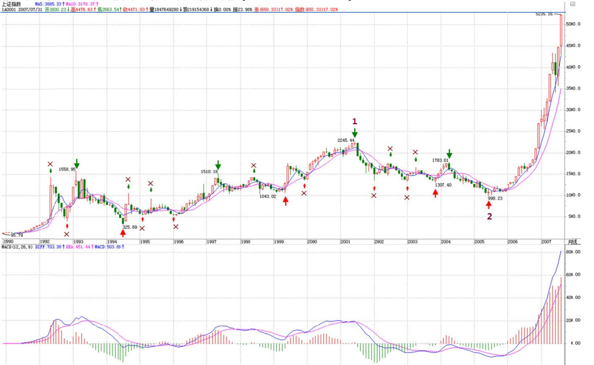
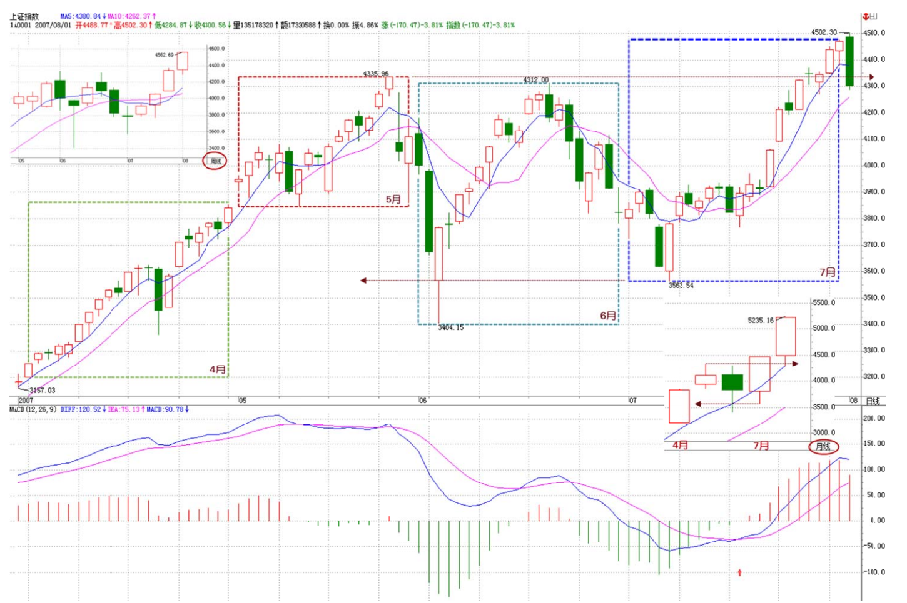
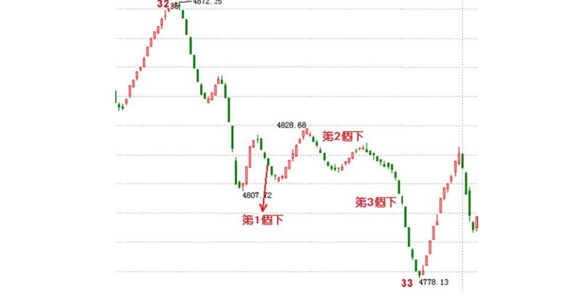

# 69.月线分段与上海大走势分析、预判

> **url**: http://blog.sina.com.cn/s/blog_486e105c01000c5b.html
>
> **time**: *2007-08-09 23:03:22*

## 原文

分型、笔、线段，在1分钟图上可以分辨，在月线图上的道理是一样的。但用月线图分辨，等于用一个精度超低的显微镜，只能看一个大概，但这个大概，却是最实质性的，是一个大方向。

下面，就是上海指数的月线图。绿箭头指着的是顶分型，红箭头的是底分型。打“X”的就是该分型不符合笔所要求分型的规范。这里，只要是两条：一、顶和底之间没有至少一K线；二、不满足顶必须接着底、或底必须接着顶。

例如，第一个红箭头和第二个绿箭头之间显然不能构成一笔，也就是说，这两个，只能取一个：如果取第一个红箭头，那么第二个绿箭头就不是笔中分型，那么第二个红箭头，显然是一个底分型，因此，就形成两个底分型连续的划分，显然，这时候，第一个就不算了，这和前面说取第一个红箭头对着的底分型矛盾。所以，这里，只能取第二个绿箭头，这时候，第一个绿箭头对应的顶分型，自然就不算笔中的顶了。

后面的各分型，带“X”的，都可以按照上面两个原则去分析。

有人可能要问，这样分型的确定，在当下如何完成？这必须当下去完成。例如，当走势走到第一个红箭头时，显然，第一绿箭头的顶分型也可以暂时看成是确定的顶分型。但当第二绿箭头走出来后，这个问题就有了可修改的地方。

有人可能要疑问，这样分型是否随时可以修改？答案是否定的。一旦完成的图形，这修改就不可能了。分型可修改，证明图形没完成。例如，当第二个红尖头分型出现后，前面三个的分型的取舍就是唯一的。这个分型的可修改性，反而是一个对走势判断极为有利的性质，例如，第二个绿箭头走出来后，这图形未完成的性质就是百分百确定了，但所有图形必然完成，走势必完美。如何才能完美，这样，在理论的框架下，只有极少的可能，而这些可能，就成为综合判断的关键条件。然后根据各级别图形的未完成性质，就可以使得走势的边界条件极端的明确与狭小，这对具体操作，就是极为有利的。注意，这可和概率无关，是百分百的纯理论保证，最终所依据的，就是在本ID理论最早反复强调的走势必完美原则。

其实，本ID的理论的关键不是什么中枢、走势类型，而是走势必完美，这才是本ID理论的核心。但要真正理解这个关键，可不是看字面意思就能明白的。

显然，目前月线上的第1、2段已经走出来，其中，按照线段里笔的类背驰，1的结束那顶与2结束那底都是极为容易判断的。上海指数的历史大顶与底，根据这线段的划分，都不是什么难搞的秘密。那么，对现在依然进行中的第3段走势，有什么可百分百确定的呢？

一、显然，这一段要成为段，那至少要三笔，而现在连一笔都没走完，因此，这轮行情的幅度，可想而知。也就是说，即使该笔走完，一个笔的调整后，至少还有一个向上的笔。

二、2245到998点是线段的类中枢，也就是说，只要调整那笔不跌破2245点，那么，将构成一个线段的类第三类买点，这也支持至少要走一笔。

三、笔的完成，必须要构成一个顶分型。而一个月线的顶分型将如何构成？这意味着什么，这个问题就当成是一个作业，各位去思考一下，然后给出这个结论对应的操作策略。从中也可以亲自实践一下，去明白一下理论指导下操作的力量。

最后，再提一个思考题：为什么本ID在7月份要大搞满江红，而8月以后就放手坐轿子，请利用分型的原理给本ID的行为一个技术上的解释。

## 扩展阅读

### 评论答疑

> *2007-08-09 16:32:51*
>
> 中枢的划分真难！笔，线段是原料，中枢像是一个个迷宫，这是学习您的理论的关键，对吗？
>
>  缠中说禅：按照定义来，很简单的。这不是关键，而是基础，比关键还要关键。

> *2007-08-09 16:39:04*
>
> 线段走完的划分，多少有些滞后性质，因为至少需要类顶分型中一个下的一笔后才能最终确定，虽然可以根据 macd 辅 助提前判断，但是有时即使是放量强势拉升后的线段回跌力度也很大，可以 6％上下，有时又只有 1％多，形成类 3 买，那麽从操作程序上来说， 离开中枢向上的线段，是不是即使回跌幅度连手续费都不够也要先卖出，再看情况回补呢，还是有什么好的方法可以区分可能的回跌幅度，可否 结合线段概念出来以后，再重新把操作程序给诠释一遍，谢谢！
>
>  缠中说禅：本来就不能用线段来操作，至少要 1 分钟以上级别的。当然，实际上，一定要线段操作也可以，这样就要用类背驰的概念。

> *2007-08-02 16:17:40*
>
> 怎样判断一个走势类型为完成的？如可确定中枢震荡形成或完成？ 
>
> 缠中说禅：这在课程里都有，要把这问题说清楚，要把所有课程说一遍，所以还是请把课程通读一遍。例如，某中枢震荡的结束就是形成该中 枢的第三类买卖点，这在课程里说过 N 次了，所以还是请先把课程研究一下。

> *2007-08-02 16:51:12*
>
> 请问：您画的那些图中，下面的红、绿箭头不明白啥意思，能否告知一二。(可能问题太幼稚了，不过真的不明白) 
>
> 缠中说禅：就是要你看箭头指着的黄白线或柱子面积之间的对比。

> *2007-08-13 21:40:22* 
>
> 您好！大家现在对今天大盘的32-33为什么不是三段有争论。毕竟符合其中的底分型成立的定义。希望您能讲讲。另，我对个级别的组合后再寻找区间套特别乱，希望您能说说！
>
> 缠中说禅：请先搞清楚底分型从哪里开始算起，哪里开始结束。
>
> 在这种前面是下跌的，对应的第二元素是上涨的，其特为序列就是向下看的，这第三个向下的，已经跌破原理第一段的底，怎么能属于第二段里的特微序列？
>
> 特维修了的底或顶，首先必须要属于这个特微序列才行，这是前提条件。其实，如果第二特微序列没有三个元素，就根本不存在出现分段中第二种情况的可能。
>
> 

> *2007-08-14 16:21:55*
>
> 如果第 n-1 根 K 线的高低点全在第 n 根 K 线的范围里，那么 n-1 和 n 是不是包含关系？ 缠中说禅：这当然是，难道还有什么疑问的？对於连续包含关系，必须按时间顺序，一个个合并下去。
>
> 再问：下列情况是不是包含关系？假设 n 和 n-1k 线的高低点为 gn，dn，gn-1，dn-1。 1、gn=gn-1 且 dn>dn-1；2、dn=dn-1 且 gn<gn-1；3、dn=dn-1 且 gn=gn-1；
>
> 缠中说禅：当然是。

> *2007-08-14 16:01:22*
>
> 假如我用 5 分钟以及更大级别的 K 线级别操作的话，画图也还是按照笔--线段--中枢这样的同样的方法吧？ 缠中说禅：请你先把显微镜和被显微镜这两种关系搞清楚。你当然可以只看 5 分钟图，那等於用一个不太精确的显微镜，难道 5 分钟图上就没 有线段、笔？用 1 分钟图上的线段笔，只是一个更精细的显微镜，这并不影响任何级别的操作。关键是对精确度的要求，但笔、线段等等，对 任何精确度下的图，都是必要的。本 ID 不是有一课示范了在月线上如何划分笔、线段了吗？

> *2007-08-02 16:58:28*
>
> 权证数量发生较大改变，用 MACD 比较力度怎么去校正呢？另外有空讲讲三个系统另外一个比价系统，好吗？ 缠中说禅：无须校正，那以后会说到的。

## 笔者注
