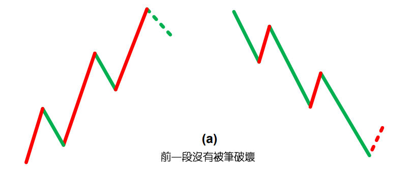
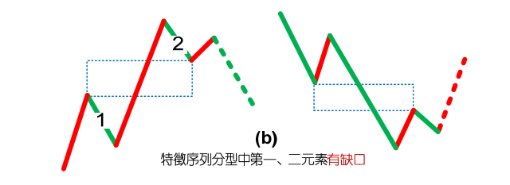
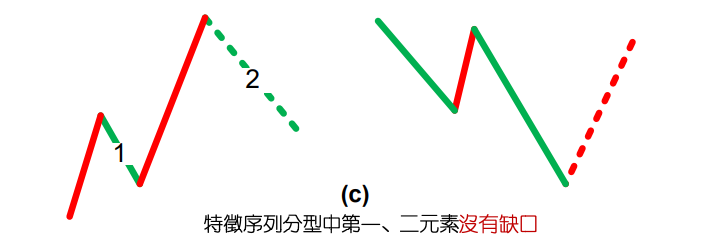
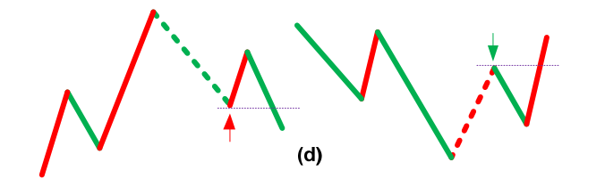
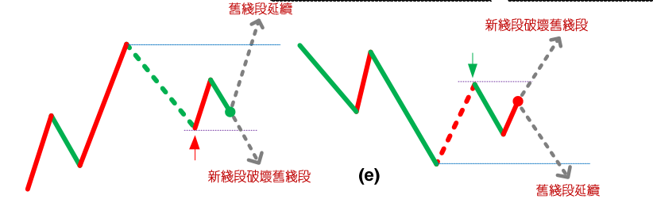
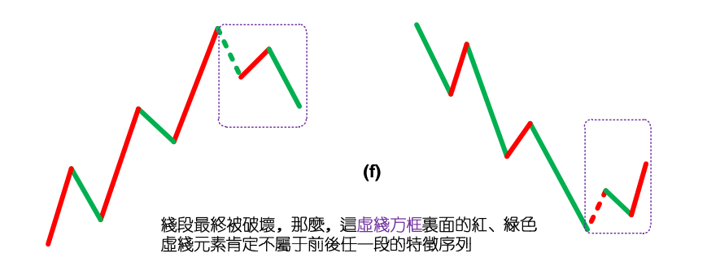
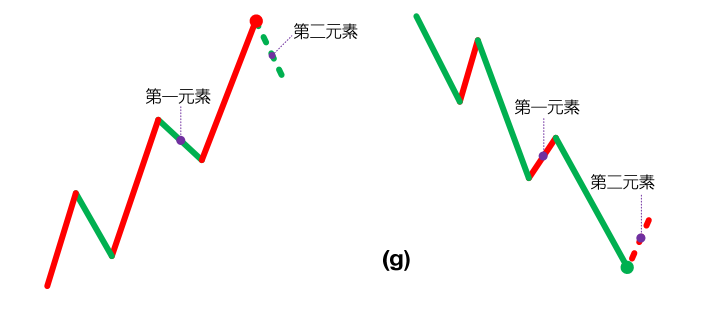
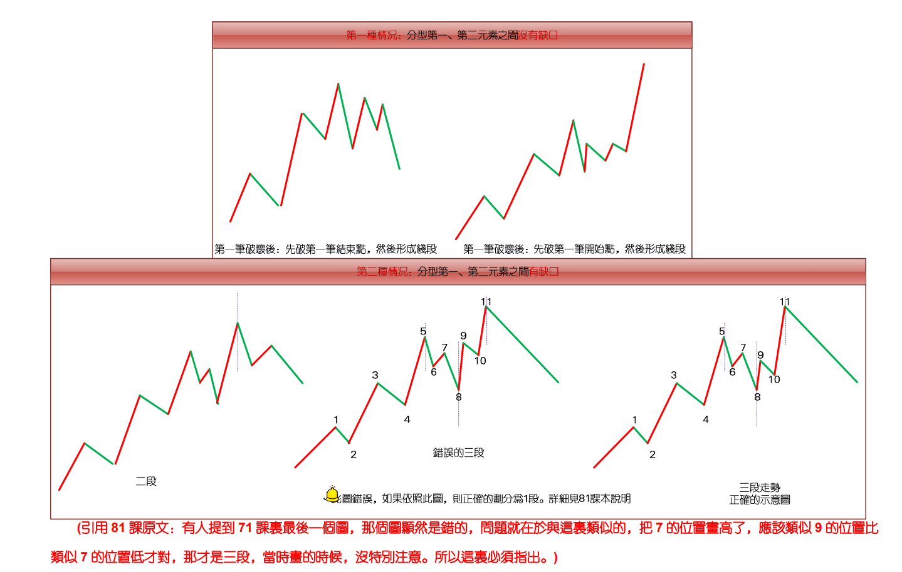

# 71.线段划分标准的再分辨

> **url**: http://blog.sina.com.cn/s/blog_486e105c01000c8i.html
>
> **time**: *2007-08-16 23:02:06*

## 原文

虽然67课已经给出了线段划分的标准，但由于那里用的是比较抽象的类数学语言，所以理解上可能还有困难，因此，逐一进行再分辨。 

首先要分辨的，是特征序列中元素的包含关系。注意，特征序列的元素包含关系，首先的前提是这元素都在一特征序列里，如果两个不同的特征序列之间的元素，讨论包含关系是没意义的。显然，特征序列的元素的方向，和其对应的段的方向是刚好相反的，例如，一个向上段后接着一个向下段，前者的特征序列元素是向下的，后者是向上的，因此，根本也不可能存在包含的可能。

那么，为什么可以定义特征序列的分型呢？因为在实际判断中，在前一段没有被笔破坏时，依然不能定义后特征序列的元素，这时候，当然可以存在前一特征序列的分型，这时候，由于还在同一特征序列中，因此，序列元素的包含关系是可以成立的；

而当前一段被笔破坏时，显然，最早破坏的一笔如果不是转折点开始的第一笔，那么，特征序列的分型结构也能成立，因为在这种情况下，转折点前的最后一个特征序列元素与转折点后第一个特征元素之间肯定有缺口，而且后者与最早破坏那笔肯定不是包含关系，否则该缺口就不可能被封闭，破坏那笔也就不可能破坏前一线段的走势。这里的逻辑关系很明确的，线段要被笔破坏，那么必须其最后一个特征序列的缺口被封闭，否则就不存在被笔破坏的情况。

那么，现在只剩下最后一种情况，就是最早破坏那笔就是转折点下来的第一笔，这种情况下，这一笔，如果后面延伸出成为线段的走势，那么这一笔就属于中间地带，既不能说是前面一段的特征序列，更不能说是后一段的特征序列，在这里情况下，即使出现似乎有特征序列的包含关系的走势，也不能算，因为，这一笔不是严格地属于前一段的特征序列，属于待定状态，一旦该笔延伸出三笔以上，那么新的线段就形成了，那时候谈论前一线段特征序列的包含关系就没意义了。

总之，上面说得很复杂，其实就是一句话，特征序列的元素要探讨包含关系，首先必须是同一特征序列的元素，这在理论上十分明确的。

从上面的分析就可以知道，从转折点开始，如果第一笔就破坏了前线段，进而该笔延伸出三笔来，其中第三笔破点第一笔的结束位置，那么，新的线段一定形成，前线段一定结束。

这种情况还有更复杂一点的情况，就是第三笔完全在第一笔的范围内，这样，这三笔就分不出是向上还是向下，这样也就定义不了什么特征序列，为什么？因为特征序列是和走势相反的，而走势连方向都没有，那怎么知道哪个元素属于特征序列？这种情况，无非两种最后的结果：1、最终还是先破了第一笔的结束位置，这时候，新的线段显然成立，旧线段还是被破坏了；2、最终，先破第一笔的开始位置，这样，旧线段只被一笔破坏，接着就延续原来的方向，那么，显然旧线段依然延续，新线段没有出现。

在67课里，把线段的划分分为两种情况，显然，分清楚是哪种情况，对划分线段十分关键。其实，在那里已经把问题说得很清楚，判断的标准只有一个，就是特征序列的分型中，第一和第二元素间不存在特征序列的缺口。从上面的分析可以知道，这个分型结构中所谓特征序列的元素，其实是站在假设旧线段没被破坏的角度说的，而就像所有的分型一样，就算是一般K线的，都是前后两段走势的分水岭、连接点。这和包含的情况不同，包含的关系是对同一段说的，而分型，必然是属于前后的，这时候，在构成分型的元素里，如果线段被最终破坏，那后面的元素肯定不是特征序列里的，也就是说，这时候，分型右侧的元素肯定不属于前后任何一段的特征序列。

这个道理其实很明白，例如前一段是向上的，那么特征序列元素是向下的，而在顶分型的右侧元素，如果最终真满足破坏前线段的要求，那么后线段的方向就是向下的，其特征序列就是向上的，而顶分型的右侧元素是向下的，显然不属于后一段的特征元素，而该顶分型的右侧元素又属于后一段，那么显然更不是前一段的特征元素。所以，对于顶分型的右侧特征元素，只是一般判断方面的一种方便的预设，就如同几何里面，添加辅助线去证明问题一样，辅助线不属于图形本身，就如同顶分型的右侧特征元素其实不一定属于任何的特征元素，但对研究有帮助，当然是要大力去用的，如此而已。

其实，线段的划分，都是可以当下完成的，无非是如下的程序：假设某转折点是两线段的分界点，然后对此用线段划分的两种情况去考察是否满足，如果满足其中一种，那么这点就是真正的线段的分界点；如果不满足，那就不是，原来的线段依然延续，就这么简单。

特征序列的分型中，第一元素就是以该假设转折点前线段的最后一个特征元素，第二个元素，就是从这转折点开始的第一笔，显然，这两者之间是同方向的，因此，如果这两者之间有缺口，那么就是第二种情况，否则就是第一种，然后根据定义来考察就可以。

这里还要强调一下包含的问题，上面的分析知道，在这假设的转折点前后那两元素，是不存在包含关系的，因为，这两者已经被假设不是同一性质的东西，不一定是同一特征序列的；但假设的转折点后的顶分型的元素，是可以应用包含关系的。为什么？因此，这些元素间，肯定是同一性质的东西，或者就是原线段的延续，那么就同是原线段的特征序列中，或者就是新线段的非特征序列中，反正都是同一类的东西，同一类的东西，当然可以考察包含关系。

估计看了上面的话，很多人更晕了。下面有几个图，各位可以仔细揣摩一下。但最好还是习惯从定义出发。另外，大盘网友问到的那个图，显然，根据定义，是两个线段，而今天42-44的分段，显然也是成立的。

注意，下图最后一个有问题，请看课程81里的更正说明。

## 扩展阅读

### 评论答疑

> *2007-08-16 15:58:06*
>
> **问**：一笔是否也有类似线段那样得三角形态或奔走形态？或者说，一笔之中的非顶、底K线是否允许超出顶底的范围呢？顶或底是否一定为一笔的最高点或最低点呢？
>
> **缠中说禅**：一笔，是一顶一底，怎么会有三角形？顶和底，当然一定是那一笔的最高最低，如果不是，那里面一定不只一笔。
>
> **再问**：不符合“顶和底，当然一定是那一笔的最高最低”理解是否正确？
>
> **缠中说禅**：怎么不符合？顶和底是对笔说的，线段是由笔构成的，请不要搞混了。一个线段里的各笔之间，还可以走出三角形、扩展平台等等形态。请搞清楚几个概念。分型对应的是笔，而特征序列里元素的分型对应的是线段的破坏判断，请不要把不同的概念搞糊涂了。
>
> 注意：
>
> 发现还有人把一笔之间的分型，与线段之中的各笔给搞混。一笔，只有一顶一底，如果顶接着顶，那其中一个肯定不是真正的顶。这是在笔的范围里说的。在笔里，当然没有什么三角形之类的东西，笔就是一线段，两个端点。但线段中的各笔之间，是可以有各种图形的，只要这些图形不破坏线段本身。请把概念搞清楚了。

> *2007-08-16 16:06:32*
>
> **问**：有个问题，前天好像才出现第三类买点，联通当时是 7.16 元，为何在这二天却有更低的价格？是受系统影响？
>
> **缠中说禅**：有没有这买点且不说，就算有，也是有级别的，难道一个 1 分钟的第三类买点就保证永远上涨，显然没有这种事情。所以先搞清楚 级别，第三类买点后两类选择，更大级别与继续上涨，如何分别这，以前课程说过，就是看相应走势是否出现盘整顶背驰。盘整顶背驰，对应 这更大级别的情况，后面出现下跌，那是天经地义的。但即使是更大级别的，从第三类买点到盘整顶背驰，理论上必然保证一段向上的过程， 更不用说继续上涨那种情况了。但理论从来不保证，向上以后就不再向下。
>
> 本 ID 反对任何操作失误被用长期投资所掩盖。长期投资，就是要在大级别买点介入，例如年线、季线、月线的买点，然后一直持有到大级 别卖点再卖，这才是真正的长期投资。
>
> 当然，中行最终肯定是套不住的，那关键操作上要有正确的思维方法，任何一个操作，必须要知道对在哪里、错在哪里。如果本来想 1 分 钟操作的，结果搞错了，就用长期投资搪塞，这样是很难进步的。用本 ID 的理论，和别的完全不同，所以必须洗心革面。在本 ID 这里，任何东 西都是有精确定义的，包括长期投资。

> *2007-08-16 16:06:32*
>
> **问**：您之前说：“这里是第一种情况，也就是特征序列缺口被第一笔就封闭的情况，没必须探讨第二段特征序列分型的问题， 那是第二种情况考虑的问题。”对此还是有疑惑，特征序列应该先考虑包含关系转换成标准特征序列，再看分型吧。
>
>  **缠中说禅**：当然没错，但注意，特征序列和实际走势是相反的。

> *2007-08-16 16:28:41*
>
> **问**：在对待顶背驰与底背驰的问题上有些困惑，底背驰抓得比较准，但顶背驰往往错过，仿佛近视了一般。 
>
> **缠中说禅**：这不是技术问题，而是心态问题。从来，大多数人都是容易买对，永远卖不对，结果就是坐电梯。说白了，就是贪婪所致。宁愿卖 早，不要卖晚，卖早，有钱赚，就有新的机会可以把握。卖晚，不仅坐电梯，还把机会成本给搞起来了。至於卖点的精度问题，那是一个磨练的 过程。卖多了，精度自然高，对理论的把握自然好。一把好刀，一次都不用，有什么用？

> *2007-08-16 16:17:45*
>
> **问**：以前好像讲过缺口视同普通 K 线，那么如何处理其与其相邻 K 线的包含关系呢？缺口可以做为顶、底分型的组成部分吗？ 
>
> **缠中说禅**：当然可以，关键是符合定义。

>  *2007-08-16 16:46:08*
>
> **缠中说禅**：本 ID 把课程里两种情况的论述复制过来，各位请好好研究：
>
>  在标准特征序列里，构成分型的三个相邻元素，只有两种可能： 
>
> 第一种情况： 特征序列的顶分型中，第一和第二元素间不存在特征序列的缺口，那么该线段在该顶分型的高点处结束，该高点是该线段的终点； 特征序列的底分型中，第一和第二元素间不存在特征序列的缺口，那么该线段在该底分型的低点处结束，该低点是该线段的终点；
>
>  第二种情况： 特征序列的顶分型中，第一和第二元素间存在特征序列的缺口，如果从该分型最高点开始的向下一笔开始的序列的特征序列出现底分型，那 么该线段在该顶分型的高点处结束，该高点是该线段的终点； 特征序列的底分型中，第一和第二元素间存在特征序列的缺口，如果从该分型最低点开始的向上一笔开始的序列的特征序列出现顶分型，那 么该线段在该底分型的低点处结束，该低点是该线段的终点；

> *2007-08-16 16:53:50*
>
> **问**：把昨天的发言帖过来：“庄托是在高位让人们买，我是在低位买，同一种理由，两种结果。在别人热情的时候我们要走 开，在别人抛弃的时候我们要捡起来。这就是最重要的操作策略。”基本面并没能错，只有基本面才能决定股价的长期走势。只是买入的时点很 重要，在 416，18 元的时候，说重组基本面，让大家买入，那是骗人的，在 416，前一段时间，7-8 元的时候，让大家买入，理由同样是基本面， 那就是抄底了。所以在股市最重要的是克服自己的恐惧和贪婪。 
>
> **缠中说禅**：对，关键是买点的级别。在一个 1 分钟买点买了说要长期投资，那是自欺欺人。

## 笔者注
